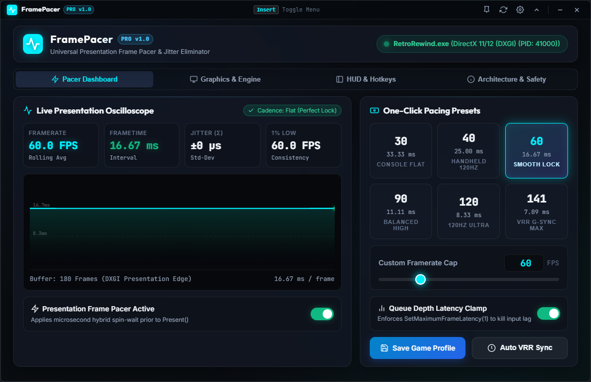
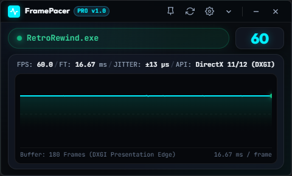
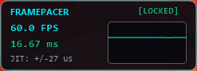

# FramePacer

<div align="center">
  
  
  ### Universal Presentation Frame Pacer & Jitter Eliminator
  
  *Sub-millisecond presentation-edge pacing for perfectly flat frametime cadence.*

  [](https://github.com/ZuhuInc/Zuhu-s-Frame-Pacer)
  [](https://github.com/ZuhuInc/Zuhu-s-Frame-Pacer)
  [](https://github.com/ZuhuInc/Zuhu-s-Frame-Pacer)
  [](LICENSE)
</div>

---

## Overview

**FramePacer** is a lightweight, high-precision frame pacing utility engineered for PC gaming, single-player titles, emulators, and display frame generation tools (like Lossless Scaling / LSFG). 

Unlike traditional software frame limiters that sleep inside CPU render threads—which often leads to micro-stutter and display presentation jitter—FramePacer intercepts frames directly at the **Presentation Edge** (`IDXGISwapChain::Present` / `Present1`) using microsecond-accurate hybrid spin-wait timing.

```text
+------------------+     +-------------------+     +--------------------------+
|  Game Engine CPU | --> | DirectX / Vulkan  | --> | FramePacer Presentation  | --> Display Swapchain
|   Render Loop    |     |    Draw Calls     |     |   Microsecond Pacing     |     (Flat Cadence)
+------------------+     +-------------------+     +--------------------------+
```

---

## Interface Previews

<div align="center">
  <h3>Main Pacer Dashboard</h3>
  

  <br><br>

  <table align="center">
    <tr>
      <td align="center" width="50%">
        <strong>Cyberpunk Mini Widget Mode</strong><br><br>
        
      </td>
      <td align="center" width="50%">
        <strong>In-Game Telemetry HUD Overlay</strong><br><br>
        
      </td>
    </tr>
  </table>
</div>

---

## Key Features

- **Presentation-Edge Pacing**: Clamps frametimes right before the GPU swapchain flip, eliminating micro-stutters and uneven frame pacing.
- **Adaptive-Sync / VRR Auto-Calibration**: Automatically queries your display's native refresh rate (144Hz, 165Hz, 180Hz, 240Hz, etc.) and locks to the mathematically ideal reflex guard ceiling (e.g. 141 FPS on 144Hz, 161 FPS on 165Hz, 237 FPS on 240Hz) for zero-lag tear-free gameplay.
- **Game Profiles & Library**: Automatically tracks played games, remembers custom FPS limits per title, and provides a per-game bypass/uncapped switch.
- **Lossless Scaling & Frame Gen Sync Ratios**: Built-in 1/2x and 1/3x refresh rate multipliers tuned for pairing with LSFG, FSR 3, and DLSS 3 Frame Generation.
- **Sub-Millisecond Precision**: Combines `timeBeginPeriod(1)`, `CreateWaitableTimerEx`, and High-Resolution Query Performance Counters (QPC) with adaptive spin-wait loops.
- **Real-Time Oscilloscope**: Live visual frametime waveform oscilloscope, rolling FPS average, standard deviation jitter calculation (±µs), and 1% low consistency metrics.
- **Compact Mini Mode with Direct Type-in**: Switch to a sleek cyberpunk floating widget (480 × 290) with direct click-to-type numeric framerate editing.
- **In-Game Transparent HUD Overlay**: Hardware-accelerated GDI+ click-through overlay with anti-aliased live sparkline graphs.
- **Safe Auto-Attach Engine**: Automatically detects active 3D game windows while safeguarding system processes, background overlays, and anti-cheat protected titles.
- **Zero Global Registry Pollution**: In-process hooking that leaves your Windows Vulkan and DirectX system registry 100% clean.

---

## Global Hotkeys

| Hotkey | Action | Description |
| :--- | :--- | :--- |
| <kbd>Insert</kbd> | **Toggle Dashboard** | Show / Hide the main FramePacer window from anywhere |
| <kbd>F11</kbd> / <kbd>Ctrl</kbd> + <kbd>Shift</kbd> + <kbd>O</kbd> | **Toggle In-Game HUD** | Show / Hide the transparent in-game telemetry HUD overlay |
| <kbd>Ctrl</kbd> + <kbd>Shift</kbd> + <kbd>P</kbd> | **Toggle Pacer Engine** | Instantly switch between locked precision pacing & raw passthrough |
| <kbd>Ctrl</kbd> + <kbd>Shift</kbd> + <kbd>↑</kbd> / <kbd>↓</kbd> | **Fine-Tune FPS** | Adjust your target FPS limit on the fly in ±1 FPS steps |

---

## Getting Started

### Prerequisites
- **Windows 10 / 11 (64-bit)**
- **Node.js** (v18 or newer)
- **Visual Studio 2019 / 2022 / Build Tools** (C++ x64 Build Tools)

### Quick Start (Development)
```bash
# 1. Clone repository
git clone https://github.com/ZuhuInc/Zuhu-s-Frame-Pacer.git
cd Zuhu-s-Frame-Pacer

# 2. Install dependencies
npm install

# 3. Build C++ engine binaries
build.bat

# 4. Launch FramePacer
npm start
```

*Or simply double-click `Start_FramePacer.bat`.*

---

## 📦 Building Standalone Executable (.exe)

To generate a standalone single-file portable distribution of FramePacer:

1. Double-click **`Build_Executable.bat`** (or run `npm run build:exe`).
2. Your single-file executable will be generated at:
   ```text
   dist/FramePacer-Portable.exe
   ```
   *(You can copy this single `.exe` file to any folder or computer and run it directly without needing any extra folders or installations!)*

---

## Architecture

```text
FramePacer/
├── src/
│   ├── dxgi_hook.cpp / .h       # DirectX 11 & DirectX 12 presentation VTable hook
│   ├── vulkan_hook.cpp / .h     # In-process Vulkan presentation dispatcher
│   ├── timing_engine.h          # Microsecond hybrid spin-wait QPC pacer
│   ├── transparent_overlay.cpp  # GDI+ layered click-through in-game HUD
│   ├── bridge_server.cpp        # Real-time WebSocket IPC telemetry bridge
│   ├── game_watcher.h           # Auto-detection scanner & process injector
│   └── minhook/                 # Minimalist x64 instruction relocation engine
├── ui/
│   ├── index.html               # Modern Dashboard & Mini Widget interface
│   ├── css/style.css            # Dark glassmorphic styling system
│   └── js/                      # Real-time WebSocket telemetry & oscilloscope canvas
├── assets/                      # Vector SVG icons, ICOs, and tray graphics
├── main.js                      # Electron main lifecycle & global hotkey manager
├── build.bat                    # MSVC compiler script for C++ engine binaries
└── Build_Executable.bat         # One-click standalone executable packaging script
```

---

## Roadmap

- [x] DirectX 11 & DirectX 12 Presentation-Edge Pacing
- [x] Real-time oscilloscope with Jitter (±µs) and 1% lows
- [x] Hardware-accelerated transparent in-game HUD
- [x] Mini mode Cyberpunk widget with direct numeric input
- [x] Standalone single-file .exe packaging
- [x] Per-game custom profiles & auto-saving library
- [x] Adaptive-Sync / VRR Display Detection & Auto-Calibration
- [x] Lossless Scaling & Frame Generation sync multipliers
- [ ] In-process Native Vulkan (`vkQueuePresentKHR`) engine
- [ ] Steam Deck / Windows Handheld auto-TDP synchronization

---

## Anti-Cheat & Safety Disclaimer

FramePacer is designed specifically for **single-player games, retro games, emulators, and local display enhancements**. 

Because DLL injection and presentation table hooking are used, kernel-level multiplayer anti-cheat systems (e.g., Easy Anti-Cheat, BattlEye, Vanguard, Ricochet) will block or flag third-party hooks. FramePacer includes a comprehensive process blocklist to protect known multiplayer titles from being attached.

---

## License

Distributed under the **MIT License**. See `LICENSE` for more information.

Developed by **ZuhuInc**.